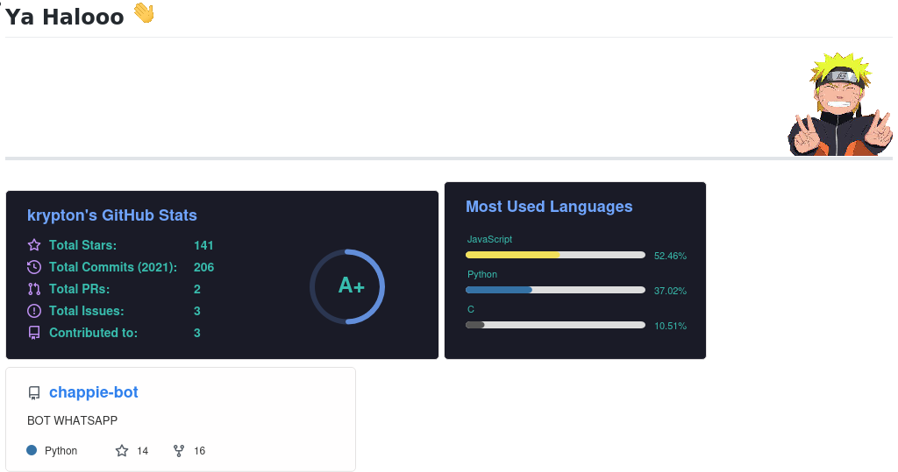

# Install
```bash
$ sudo apt install wkhtmltopdf
$ python3 -m pip3 install imgkit bs4 requests
$ python3
```
```python
>>> from Github_Markdown_render import readme
>>> readme("https://github.com/krypton-byte/krypton-byte")

OR

>>> readme("https://github.com/krypton-byte/krypton-byte", "save.png")

Preview

>>> from PIL import Image
>>> out=readme("https://github.com/krypton-byte/krypton-byte")
>>> Image.open(out).show()
```
# Preview
